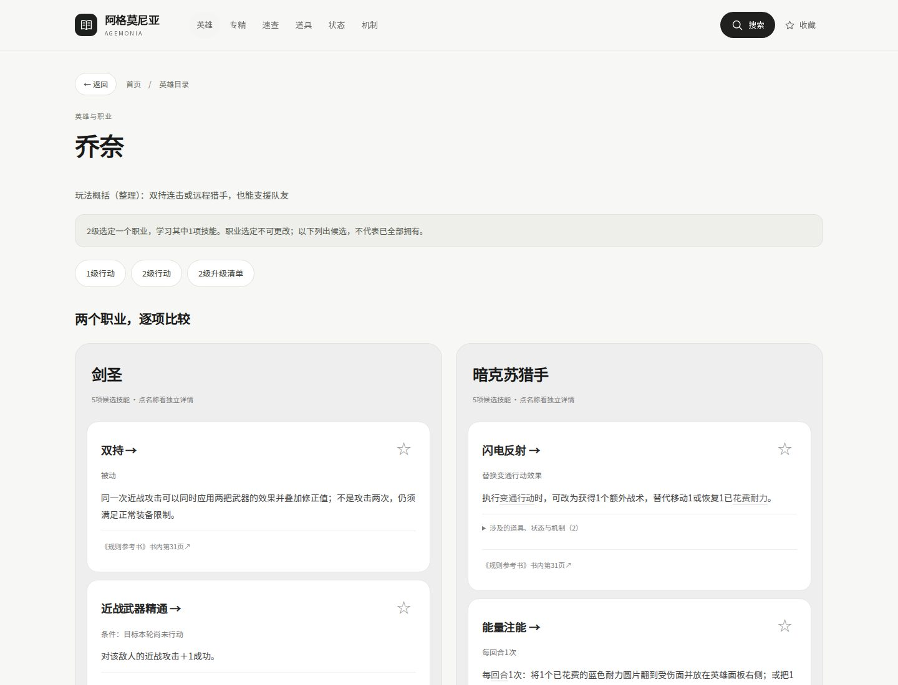

# Auralis 浅色风格实验

分支：`experiment/auralis-light`，基于 `main` 的 `408b54a`。

这版采用参考稿中的浅灰底、黑色操作按钮、无衬线标题、白色圆角卡片和少量淡彩。首页重新组织搜索与分类入口，规则页采用同一套样式。

- 桌面端并排比较两个职业；手机端可切换职业或查看全部。
- 手机底部提供首页、英雄、速查、收藏入口。
- 按 `/` 可进入搜索并聚焦输入框。
- 规则正文、数值、原书图示、页码及引用链接保持原样。

## 查看

```bash
git fetch origin
git switch experiment/auralis-light
python3 -m http.server 8000
```

打开 `http://localhost:8000`。也可直接打开 `index.html`；收藏由当前浏览器本地保存。

## 桌面预览




## 手机预览


## 维护与验证

样式位于 `assets/auralis.css`；手机职业切换、底部导航状态和搜索快捷键位于 `assets/auralis.js`。`index.html` 只修改公共导航、首页和资源引用，原有 `guide.js` 与 `guide.css` 均未改动，无新增运行依赖。

已通过内容比对：587 个页面，除首页外所有页面正文 HTML 不变；原图和原有页面链接保持完整。浏览器检查覆盖 320、390、768、1024、1440px 下的代表页面，无横向溢出；搜索、筛选、清除、收藏及刷新保留、职业切换、关联规则展开、原页查看/缩放/返回、键盘搜索和禁用 JavaScript 的阅读导航均通过。

这是独立的视觉试验，尚未合并或部署到主站。
